# Week 2: Declarative UI & Responsive Design

**Name:** Dewi Chalissa Rania  
**Class:** TI 3I  
**NIM:** 244107020023  

---

## 📋 Checklist

- [x] `flutter analyze` produces no errors.
- [x] `flutter test` passes all responsive widget tests.
- [x] The application runs at narrow and wide screen sizes.
- [x] Dark mode has sufficient contrast and readable text.
- [x] The widget structure can be explained during code review.
- [x] Screenshots, the `test/` folder, and `README.md` are stored in the Week 2 assignment folder.

---

## 🧪 Lab: Simple Layout (Warm-Up)

### Result Warm-Up


### UI Without Using Expanded


### Using `mainAxisSize: MainAxisSize.max`
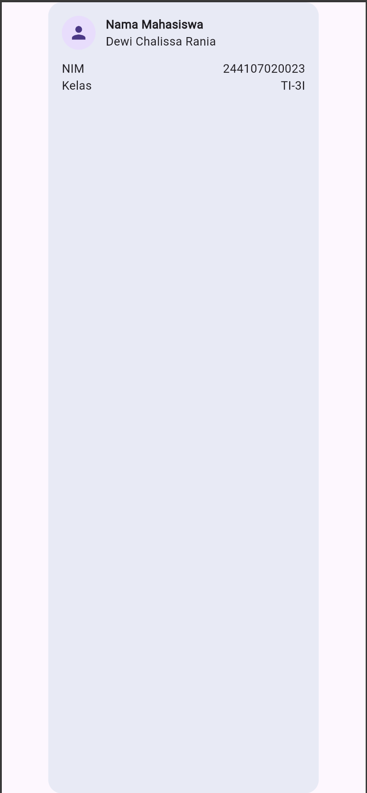

### Add Email Data


---

## 📱 Practical Lab: Responsive Dashboard

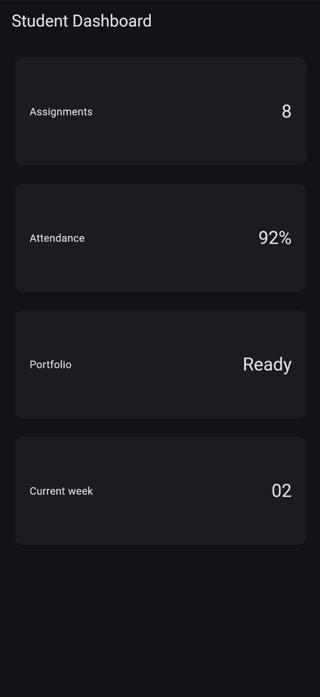

### Adding Interaction: `StatefulWidget` and Cupertino
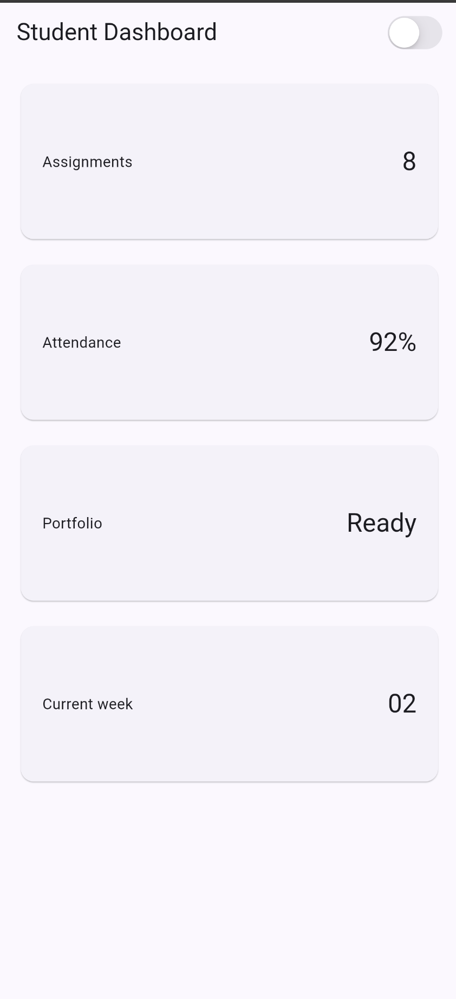

### Adjust `DashboardPage` to Receive State & Callback
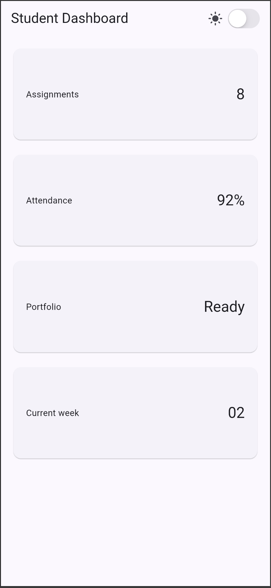

### Change 700 Breakpoint to 100
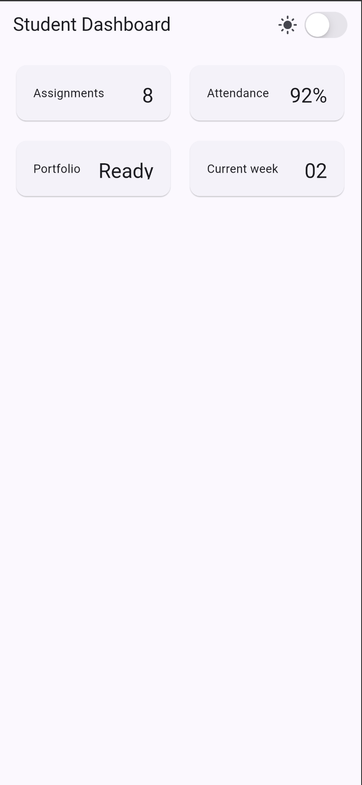

### Change `themeMode` to `ThemeMode.dark`
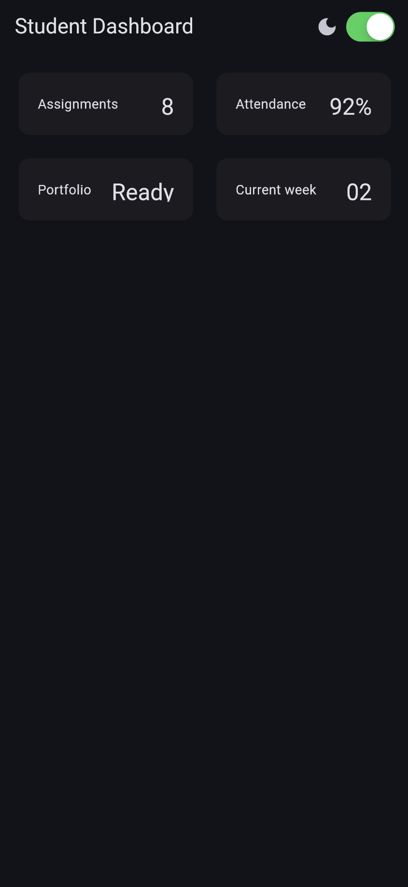

### Change `themeMode` to `ThemeMode.system`
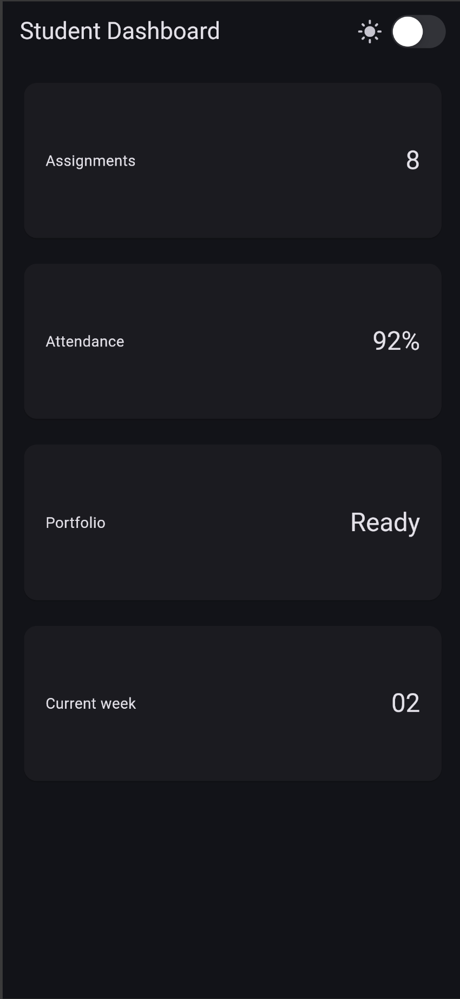

### Testing Application at Different Emulator Screen Sizes
* **iPad Air**  
  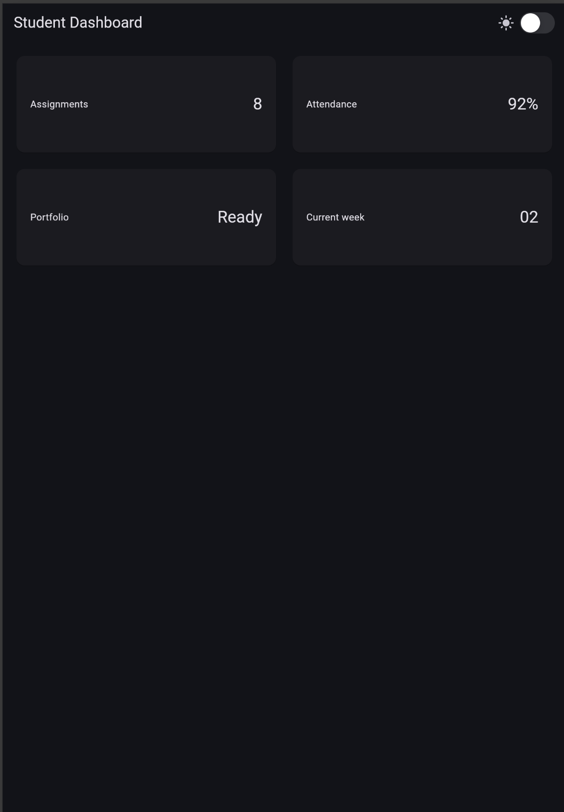
* **iPhone 15 Pro Max**  
  

#### Accessibility: Add Semantics or Meaningful Labels
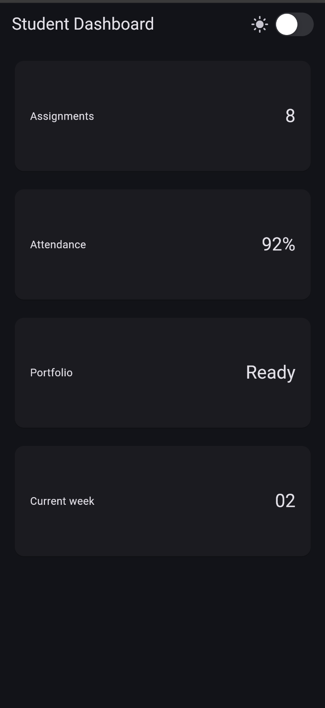

---

## 🚀 Assignment and AI Design Exploration

### Main Assignment Screenshots
* **Narrow Screen**  
  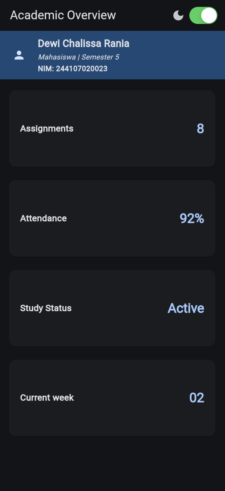
* **Wide Screen**  
  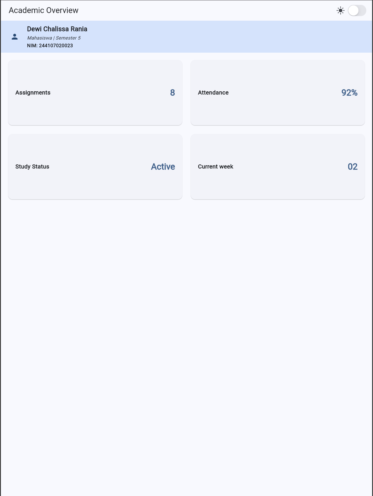

---

### AI Prompt Challenge

#### Challenge 1: Layout Trade-Off Analysis (`GridView` vs. `LayoutBuilder + Column`)

> **Prompt:** *Compare two Flutter academic dashboard layouts: a GridView version and a LayoutBuilder + Column version. Explain the responsive and accessibility trade-offs.*

##### 📊 Trade-Off Matrix

| Feature | `GridView` Layout | `LayoutBuilder` + `Column` Layout |
| :--- | :--- | :--- |
| **Responsive Flexibility** | **Rigid.** Enforces fixed aspect ratios (`childAspectRatio`). Hard to embed heterogeneous elements (e.g., full-width student profile headers). | **High.** Evaluates `constraints.maxWidth` to dynamically shift grid columns, stack cards, or inject dynamic headers. |
| **Height Adaptation** | **Fixed Cell Heights.** Varying card content or dynamic text lengths trigger bottom clipping or overflow errors. | **Intrinsic Heights.** Cards auto-expand vertically based on child content size. |
| **Accessibility (Text Scaling)** | ⚠️ **High Overflow Risk.** OS text scaling (1.5x–2.0x) breaks cell boundaries (`RenderFlex overflow`). | ♿ **WCAG Compliant.** Text expands vertically down the page; accommodated via parent `SingleChildScrollView`. |
| **Screen Reader Flow** | Matrix navigation (strict row-by-row reading order). | Natural linear top-to-bottom reading order. |

##### 🎯 Selected Decision
**Recommendation:** Use **`LayoutBuilder` + `Column` / `Wrap`** (wrapped inside a `SingleChildScrollView`).

> *Note: Reserve `GridView` only for homogeneous, lazily-loaded lists where every item has identical structural height and fixed content limits.*

##### ⚙️ Technical Reasoning
1. **Intrinsic Height & Font Scaling (Accessibility):** Accessible UIs must gracefully handle up to 200% font zoom. `GridView` relies on `childAspectRatio`, causing `RenderFlex` overflows when text sizes grow. `Column` allows cards to size natively based on text content height.
2. **Heterogeneous Section Composition:** Academic dashboards feature mixed content blocks (e.g., student ID profile card banner + multi-column metrics). `LayoutBuilder` allows easy breakpoint switching (`maxWidth > 600`) to stack or span mixed components conditionally.
3. **Overflow Elimination:** Real-world academic data (e.g., longer status names, localized translations, large numbers) varies in length. A dynamic column layout inside a scroll view ensures content is never clipped or constrained by rigid box aspect ratios.

---

#### Challenge 2: Flutter `Expanded` Overflow / Infinite Constraint Bug

> **Prompt:** *Explain when using Expanded actually causes an overflow inside a Row; show failing example code and its fix.*

`Expanded` requires **bounded horizontal constraints** from its parent `Row` to calculate how much remaining space to allocate to its child.

When a `Row` is placed inside an unbounded horizontal parent (such as a `SingleChildScrollView(scrollDirection: Axis.horizontal)` or horizontal `ListView`), the available width is `double.infinity`. `Expanded` cannot divide infinite space, triggering a layout assertion error / overflow exception:

> `RenderFlex children have non-zero flex but incoming width constraints are unbounded.`

##### ❌ Failing Code
```dart
// ❌ FAILS: SingleChildScrollView gives infinite horizontal width.
// Expanded cannot calculate remaining space against infinity.
Widget build(BuildContext context) {
  return SingleChildScrollView(
    scrollDirection: Axis.horizontal,
    child: Row(
      children: [
        const Icon(Icons.school),
        Expanded(
          child: Text('Student Dashboard Academic Overview Header'),
        ),
      ],
    ),
  );
}
```

##### ✅ How to Fix the Code

**Option A: Standard Responsive Layout (Remove horizontal scroll)**
```dart
// ✅ FIX: Bounded width allows Expanded to clamp child within screen bounds.
Widget build(BuildContext context) {
  return Row(
    children: [
      const Icon(Icons.school),
      Expanded(
        child: Text('Student Dashboard Academic Overview Header'),
      ),
    ],
  );
}
```

**Option B: Keep Horizontal Scroll (Remove `Expanded`)**
```dart
// ✅ FIX: Content sizes naturally along the infinite scroll axis.
Widget build(BuildContext context) {
  return SingleChildScrollView(
    scrollDirection: Axis.horizontal,
    child: Row(
      children: [
        const Icon(Icons.school),
        Text('Student Dashboard Academic Overview Header'),
      ],
    ),
  );
}
```

---

#### Challenge 3: Verification Prompt (Self-Audit AI)

> **Prompt:** *Review the layout recommendation above: does it stay responsive below 600px, does it reduce accessibility, and are all widgets available in the current stable Flutter?*

##### 1. Does it stay responsive below 600px?
* **What works:** `LayoutBuilder` correctly switches `crossAxisCount` to `1` when `maxWidth < 600`.
* **The Constraint Limitation:** `GridView.count` enforces `childAspectRatio: 2.6`.
  * On a 360px mobile screen, card height is fixed to `~(360 - 32) / 2.6 = 126px`.
  * If card titles are long or text scales up, fixed card heights cannot grow vertically, leading to internal card overflows.

##### 2. Does it reduce accessibility?
* **Text Scaling Risk (High):** When users increase OS font size (Text Scale Factor 1.5x–2.0x for low vision), text inside `DashboardCard` cannot expand the card height because `GridView` enforces rigid ratios. This causes text clipping or `RenderFlex overflow` error banners.
* **Screen Reader Redundancy:** The profile header uses `Semantics(label: '...', child: Container(...))`. Without setting `excludeSemantics: true`, screen readers (TalkBack / VoiceOver) read the full summary label *and* then read out every text node inside again.

##### 3. Are all widgets available in current stable Flutter?
* **Yes.** Every widget used (`MaterialApp`, `Scaffold`, `AppBar`, `Semantics`, `CupertinoSwitch`, `LayoutBuilder`, `GridView.count`, `Card`, etc.) is part of standard `package:flutter/material.dart` and `package:flutter/cupertino.dart`. No external packages required.

---

### 🛠️ Refactoring Challenge

#### 1. Extract the information card into a reusable widget (e.g. `InfoCard`)
Metric cards now use the `InfoCard` widget. This widget accepts `title` and `value` parameters, allowing the four dashboard cards to be instantiated simply with different data. Layout structure, accessibility labels, and card styling no longer need to be duplicated.

#### 2. Replace hardcoded colors and sizes with `Theme.of(context)`
The profile header color uses `primaryContainer`, while the card value color uses `theme.colorScheme.primary`. Card text styles are also derived directly from `theme.textTheme`, customized only with structural emphasis such as `fontWeight`. This ensures colors and contrast automatically adapt to both light and dark modes. Font sizes are no longer hardcoded with manual numbers on the cards, allowing them to respect the theme's typography scale and Flutter's accessibility settings.

#### 3. Move the breakpoint into a single named constant (e.g. `const kWideBreakpoint = 700;`)
The wide-screen breakpoint is defined centrally via `kWideBreakpoint`. `LayoutBuilder` uses this constant to dynamically switch between two columns on wide screens and a single column on narrow viewports. If the responsive threshold needs to be modified, only a single declaration needs to be updated.

#### 4. Run `flutter analyze` and ensure zero errors or warnings
The following command was executed from the project root directory:

```bash
flutter analyze lib/responsive_dashboard_practicum/main.dart
```

The output returned `No issues found!`, confirming that the refactoring introduced no Dart analysis errors or warnings.

---

### 🧪 Basic Testing

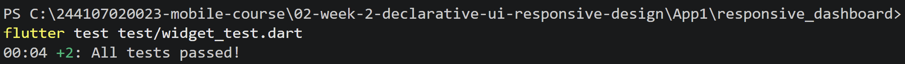

---

## 💡 Reflection

### 1. Imperative vs. Declarative UI
* **Imperative:** Manually manipulates UI elements step-by-step when events occur (e.g., `element.setText("Hello")`).
* **Declarative:** Describes *what* the UI should look like for any given state ($UI = f(state)$). Flutter automatically rebuilds the widget tree when state changes.

### 2. When `Expanded` Helps vs. Causes Layout Errors
* **Helps:** Inside bounded `Row`/`Column` widgets to fill available space, wrap long text, and prevent overflow.
* **Causes Error:** Inside unbounded scrollable parents (e.g., `Row` inside `SingleChildScrollView(scrollDirection: Axis.horizontal)`). `Expanded` cannot divide infinite space (`double.infinity`), causing an unbounded constraint assertion error.

### 3. Impact of Breakpoints & Themes on User Experience
* **Breakpoints:** Adapt layouts seamlessly across screen sizes (mobile, tablet, desktop) to optimize readability and screen real estate.
* **Themes:** Maintain visual consistency across light and dark modes while ensuring high contrast and accessible typography scaling.

### 4. What Was Verified After AI Design Recommendations
* **Responsiveness:** Verified layout behavior above and below breakpoints (`< 600px` vs `≥ 600px`).
* **Accessibility:** Checked for font scale overflows (up to 200% zoom) and eliminated duplicate screen-reader semantics.
* **Code Integrity:** Ran `flutter analyze` and widget tests to confirm zero errors or layout assertion warnings.